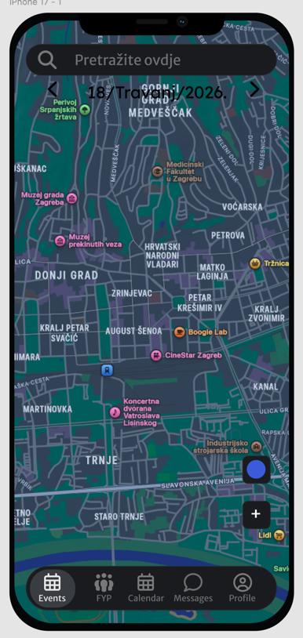

# Gdje i Kada - projektna dokumentacija

Status dokumenta: 2026-04-30
Projekt se ne radi ispocetka. Postojeci React Native/Expo frontend i Spring Boot backend ostaju baza, a nove funkcionalnosti se nadograduju na vec postojece klase, rute, storeove, hookove i dizajn sustav.

Radimo mobilnu event aplikaciju "Gdje i Kada" za iOS i Android. Frontend je React Native kroz Expo Router, backend je Spring Boot s PostgreSQL bazom. Nemoj kretati ispocetka. Prvo procitaj postojeci kod i nadogradi ga prema lokalnim patternima.

Repo struktura:

- `Gdje-I-Kada-Native/` - Expo React Native aplikacija.
- `backend/` - Spring Boot backend.

Pravilo dokumentacije:

- Nakon svake bitne promjene aplikacije azurirati `README.md` i `FAZE.md`.
- Ako se faza rijesi, u `FAZE.md` joj promijeni status u `Rijeseno` i dodaj zavrsnu biljesku da se ista faza kasnije ne radi ponovno bez nove dopune ili regresije.
- Dokumentacija je dio implementacije; kod se ne smatra dovrsenim ako README/FAZE opisuju staro stanje.

Glavna ideja aplikacije:

Aplikacija pomaze korisniku pronaci evente oko sebe, pregledati ih na mapi ili kroz Reels/FYP feed, pridruziti se eventu, otvoriti detalje, komunicirati kroz privatne i event chatove, vidjeti svoj kalendar eventova i urediti profil/postavke. Cilj je native-feeling aplikacija za iOS i Android, s posebnim naglaskom na iOS Liquid Glass gdje god ima smisla, ali uz dobar Android fallback.

Planirani glavni tabovi:

1. `Mapa`
2. `Reels/FYP`
3. `Kalendar`
4. `Poruke`
5. `Profil`

Trenutno stanje tabova:

- Mapa je implementirana kao `app/(tabs)/index.tsx` i rendera `EventsMapExperience`.
- FYP je implementiran kao `app/(tabs)/fyp.tsx`.
- Kalendar je implementiran kao `app/(tabs)/calendar.tsx` i prikazuje joined-only mjesecni grid s event oznakama, searchom i povratkom na danas.
- Poruke su glavni tab kroz `app/(tabs)/messages.tsx`; chat screen je `app/chat/[id].tsx`.
- `app/(tabs)/social.tsx` ostaje prototip/sekundarni ekran za conversations + friends, ali vise nije glavni tab.
- Profil je implementiran kao `app/(tabs)/profile.tsx`; trenutno prikazuje osnovni profil, liked events history, jezik, temu i odjavu. Jos trebaju transaction history, edit profila i poseban settings ekran.

Postojece frontend tehnologije i patterni:

- Expo SDK 54, React 19, React Native 0.81, TypeScript.
- Android i iOS trenutno koriste `newArchEnabled=true` jer `react-native-reanimated` i `react-native-worklets` to zahtijevaju pri buildu. Za iOS je ostao i pojacani `react-native-maps` (`AIRMap`) patch u `scripts/patch-react-native-maps-airmap.js`.
- iOS workspace sada ima dva native targeta/schemea: `GIKDev` i `GIKTest`. `npm run ios` / `npm run ios:dev` prije builda automatski pripremaju `ios/.xcode.env.local` za lokalni `prod`/dev variant (`localhost` backend) i pokrecu `GIKDev`, a `npm run ios:test` / `npm run ios:test:release` pripremaju test env i pokrecu `GIKTest`.
- Navigacija: `expo-router` i `expo-router/unstable-native-tabs` u `app/(tabs)/_layout.tsx`.
- Data fetching/cache: TanStack React Query u `core/api/query-hooks.ts` i `core/query/query-client.ts`.
- HTTP: Axios u `core/api/http-client.ts`, s Bearer token interceptorom iz `useAuthStore`.
- Global state: Zustand u `core/store/app-store.ts` i `core/store/auth-store.ts`.
- Auth token storage: `expo-secure-store` u `core/store/auth-store.ts`, sa stabilnim `keychainService`, iOS `AFTER_FIRST_UNLOCK_THIS_DEVICE_ONLY`, migracijom iz starog SecureStore keychaina i AsyncStorage mirror fallbackom za cold start pouzdanost na lokalnim, test i produkcijskim buildovima.
- Android test/native build mora imati SecureStore backup exclusion pravila (`secure_store_backup_rules.xml` i `secure_store_data_extraction_rules.xml`) da se encrypted SecureStore prefs ne vrate bez Android Keystore kljuca nakon install/re-run ciklusa.
- i18n: rucni HR/EN prijevodi u `core/i18n/translations.ts` i `useI18n`.
- Theme: `AppThemeProvider`, `createAppTheme`, `palette`, `tokens`, `ThemeToggle`.
- Kalendar grid: `react-native-calendars` za cross-platform mjesecni prikaz bez dodatnog native linkinga.
- iOS glass: `expo-glass-effect` i `expo-blur` se vec koriste u `EventDetailSheet` i `MapSearchBar.ios.tsx`; `AppCard` i `AppButton` imaju blur glass varijantu. Kod novih iOS povrsina preferirati `GlassView` kad je `isLiquidGlassAvailable()` i `isGlassEffectAPIAvailable()`, uz `BlurView` ili themed surface fallback.
- Karte:
  - iOS: `components/map/event-map-surface.ios.tsx` koristi `react-native-maps` / MapKit.
  - Android: `components/map/event-map-surface.android.tsx` koristi `@maplibre/maplibre-react-native` i prikazuje pojedinacne event pinove bez clusteriranja.
  - Shared API: `components/map/event-map.tsx`, `components/map/types.ts`, `MapMarkerBadge`, `EventDetailSheet`.
- Lokacija: `features/events/hooks/use-map-location-bootstrap.ts` trazi consent, koristi `expo-location`, Android MapLibre fallback i IP/capital fallback.
- Search po eventima na mapi: `features/events/hooks/use-event-map-search.ts`, `MapSearchBar`, `MapSearchResults`.
- Frontend unit testovi: Jest kroz `jest-expo`, trenutno pokrivaju `selectEvents`, date formatting i location search servise/providere.

Postojece backend tehnologije i patterni:

- Spring Boot 4.0.5, Java 25, Maven.
- PostgreSQL.
- Flyway migracije u `backend/src/main/resources/db/migration`.
- MyBatis mapperi u `backend/src/main/resources/mapper` i Java mapper interfacei u persistence paketima.
- Spring Security stateless JWT auth:
  - `SecurityConfig`
  - `JwtAuthenticationFilter`
  - `JwtService`
  - `AuthService`
- BCrypt password hashing.
- Google i Apple login id token verifikacija kroz:
  - `GoogleIdTokenVerifierService`
  - `AppleIdTokenVerifierService`
  - `AudienceValidator`
- REST endpointi kroz controllere:
  - `AuthController`
  - `EventController`
  - `SocialController`
  - `MessageController`
- Chat realtime koristi WebSocket endpoint `/ws/messages`; JWT se validira u handshakeu, a REST endpointi i dalje ostaju canonical write path za slanje poruka, event share, pollove i room update.
- Backend unit testovi: JUnit 5 + Mockito, trenutno pokrivaju `EventService`, `PasswordPolicy` i `JwtService`.

Backend trenutno ima:

- `POST /api/auth/register`
- `POST /api/auth/login`
- `POST /api/auth/google`
- `POST /api/auth/apple`
- `GET /api/auth/me`
- `GET /api/events?from=&to=&lat=&lng=&radiusKm=&query=`
- `GET /api/events/{id}`
- `POST /api/events`
- `POST /api/events/{id}/join`
- `DELETE /api/events/{id}/join`
- `POST /api/events/{id}/like`
- `DELETE /api/events/{id}/like`
- `GET /api/users/me/events?filter=all|joined|created`
- `GET /api/users/me/liked-events`
- `GET /api/feed?cursor=&limit=`
- `GET /api/social/friends`
- `GET /api/messages/chat-rooms?query=`
- `POST /api/messages/chat-rooms`
- `POST /api/messages/events/{eventId}/chat-room`
- `GET /api/messages/chat-rooms/{id}`
- `PATCH /api/messages/chat-rooms/{id}`
- `GET /api/messages/chat-rooms/{id}/messages`
- `POST /api/messages/chat-rooms/{id}/messages`
- `POST /api/messages/chat-rooms/{id}/share-event`
- `POST /api/messages/chat-rooms/{id}/polls`
- `POST /api/messages/polls/{id}/vote`
- `GET /api/messages/people?query=`
- `GET /api/messages/conversations` legacy adapter
- `POST /api/messages/conversations/{id}/share-event` legacy adapter

Svi `/api/**` endpointi osim public auth ruta traze `Authorization: Bearer <token>`.

Trenutna baza:

- `events` iz `V1__init_schema.sql`
  - `id`
  - `creator_user_id` iz `V4__expand_event_domain.sql`
  - `title_hr`, `title_en`
  - `where_hr`, `where_en`
  - `address`
  - `about_hr`, `about_en`
  - `when_iso`
  - `start_at`, `end_at`
  - `event_type` (`nearby`, `joined`, `created`)
  - `latitude`, `longitude`
  - `entrance_latitude`, `entrance_longitude`
  - `entry_instructions_hr`, `entry_instructions_en`
  - `visibility` (`public`, `friends`)
  - `attendance_mode` (`open`, `waitlist`, `paid`)
  - `price_amount`, `price_currency`
  - `capacity`
  - `status` (`draft`, `published`, `cancelled`, `finished`)
  - `organizer_rating_average`, `organizer_rating_count`
  - `participant_count`
  - `created_at`, `updated_at`
- `event_media` iz `V4__expand_event_domain.sql`
- `event_participants` iz `V4__expand_event_domain.sql`
- `event_likes` iz `V4__expand_event_domain.sql`
- `event_organizer_ratings` iz `V4__expand_event_domain.sql`
- `friends` iz `V1__init_schema.sql`
- `conversations` iz `V1__init_schema.sql` ostaje legacy adapter/prototip
- `chat_rooms` iz `V5__chat_rooms_messages_polls.sql`
- `chat_members` iz `V5__chat_rooms_messages_polls.sql`
- `messages` iz `V5__chat_rooms_messages_polls.sql`
- `message_reads` iz `V5__chat_rooms_messages_polls.sql`
- `polls` iz `V5__chat_rooms_messages_polls.sql`
- `poll_options` iz `V5__chat_rooms_messages_polls.sql`
- `poll_votes` iz `V5__chat_rooms_messages_polls.sql`
- `app_users` iz `V3__create_users_table.sql`
  - `id`
  - `email`
  - `full_name`
  - `password_hash`
  - `auth_provider` (`local`, `google`, `apple`)
  - `created_at`, `updated_at`

Trenutni event model:

- Frontend: `core/types/domain.ts` tip `AppEvent`.
- Backend DTO: `AppEventDto`.
- Backend request: `CreateEventRequest`.
- Persistence row: `EventRow`.
- Service: `EventService`.
- Mapper: `EventMapper` i `EventMapper.xml`.

Event trenutno podrzava naslov, lokaciju, adresu, opis, start/end datum, coordinates, entrance coordinates, entry instructions, creator user id, visibility `public/friends`, attendance mode `open/waitlist/paid`, cijenu za paid evente, capacity, status, organizer rating agregate, `likeCount`, `likedByMe`, participant count, `joinedByMe`, `attendanceStatus` i `canJoin`. Baza ima tablice za media, participants, likes, organizer ratings i event chat roomove. Join/leave i like/unlike rade kroz backend, a feed i detail endpointi vracaju `event_media` za reels/detail prikaz. Jos ne postoje pun UI/API flow za upload media, placanje ni rating submit.

Kad implementiras nove stvari, nadogradi postojece:

- Ako dodajes nova event polja, prosiri `AppEvent`, `AppEventDto`, `CreateEventRequest`, `EventRow`, `EventService`, `EventMapper.xml` i Flyway migraciju.
- Ako dodajes novi API, napravi controller/service/mapper sloj po istom patternu.
- Ako dodajes novi frontend screen, koristi `AppScreen`, `AppText`, `AppButton`, `AppCard`, theme tokens i postojece i18n kljuceve ili dodaj nove u `translations.ts`.
- Ako radis state koji mora prezivjeti restart appa, koristi Zustand persist u `app-store.ts` ili secure auth store ako je osjetljivo.
- Ako radis server state, koristi React Query i query keys.
- Ako radis iOS translucent povrsine, koristi Liquid Glass API gdje je dostupan i fallback na BlurView/surface.

## Vizija proizvoda

"Gdje i Kada" je social discovery aplikacija za evente. Korisnik otvara aplikaciju i odmah vidi evente oko sebe na mapi. Moze pretrazivati evente, filtrirati ih po datumu i tipu, otvoriti detalje, vidjeti gdje je tocno ulaz, joinati event, eventualno kupiti ulaznicu, uci u event grupu i kasnije rateati organizatora.

FYP dio aplikacije sluzi za brz discovery kroz vertikalni Reels-style feed. Svaki reel je povezan s eventom. Korisnik moze lajkati, shareati i otvoriti detalje eventa. Save/bookmark nije dio finalnog zahtjeva i treba ga ukloniti ili zamijeniti ako ostane iz starog prototipa.

Kalendar prikazuje samo evente na koje se korisnik pridruzio. Rijesen je kao native mjesecni grid s oznakama eventova po danima, searchom prijavljenih eventova i listom eventova za odabrani dan.

Poruke podrzavaju privatne razgovore, grupe, event-specific grupe, pollove i admin-only chat mod gdje samo admini pisu, a ostali mogu glasati na pollu.

Profil treba prikazivati korisnikovu aktivnost: event history, joined eventove, liked reels/evente i transaction history. Profil mora imati editiranje slike i imena. Postavke trebaju biti odvojeni ekran otvoren iz profila, a tamo idu jezik, tema i slicne opcije.

## Frontend dokumentacija

### Navigacija

Root navigacija je u `Gdje-I-Kada-Native/app/_layout.tsx`.

Trenutno:

- Ako korisnik nije autentificiran, prikazuje se `(auth)`.
- Ako je autentificiran, prikazuje se `(tabs)`, `create-event`, `entrance-map-picker` i `event/[id]`.
- Auth hidratacija se radi kroz `useAuthStore.hydrateAuth()`.
- Auth hidratacija prvo cita novi stabilni SecureStore zapis, zatim legacy SecureStore zapis i na kraju AsyncStorage mirror. Validna legacy/fallback sesija se migrira natrag u primarni SecureStore zapis.
- Ako app nakon ranije prijave zavrsi na loginu jer spremljena sesija nije ucitana, login ekran prikazuje modal s dijagnostikom storage izvora. Ako login API prodje, ali spremanje sesije padne, korisnik dobiva poseban modal za persistence problem.
- `QueryClientProvider`, `SafeAreaProvider`, `AppThemeProvider` i `GestureHandlerRootView` su globalni wrapperi.

Tab navigacija je u `Gdje-I-Kada-Native/app/(tabs)/_layout.tsx`.

Status Faze 1:

- Rijeseno 2026-04-18: glavni tabovi su uskladeni na Mapa, FYP, Kalendar, Poruke i Profil.
- `social` vise nije trigger u glavnom tab baru; `messages` je glavni tab za poruke.

Trenutni `NativeTabs.Trigger`:

- `index` label `map`
- `fyp` label `fyp`
- `calendar` label `calendar`
- `messages` label `messages`
- `profile` label `profile`

Rijeseno:

- `index` se tretira kao `Mapa`, ne kao genericki `Dogadaji`.
- `social` je maknut iz glavnog tab bara i zamijenjen s `messages`.
- Ako prijatelji ostaju u proizvodu, bit ce dio poruka/profila ili sekundarni screen, ne glavni tab.

### Mapa

Postoji:

- Screen: `app/(tabs)/index.tsx`.
- Screen model: `features/events/hooks/use-events-map-screen-model.ts`.
- Experience komponenta: `features/events/components/events-map-experience.tsx`.
- Map wrapper: `components/map/event-map.tsx`.
- Platform-specific surfaces:
  - `components/map/event-map-surface.ios.tsx`
  - `components/map/event-map-surface.android.tsx`
- Event bottom sheet: `components/map/event-detail-sheet.tsx`.
- Search:
  - `components/search/map-search-bar.tsx`
  - `components/search/map-search-bar.ios.tsx`
  - `components/search/map-search-results.tsx`
  - `features/events/hooks/use-event-map-search.ts`
- Location bootstrap: `features/events/hooks/use-map-location-bootstrap.ts`.

Trenutno ponasanje:

- App dohvat eventova radi preko `useEventsQuery(params)` i `/api/events?from=&to=&lat=&lng=&radiusKm=&query=`.
- `use-events-map-screen-model.ts` salje user lokaciju, radius 50 km, debounced search query i date filter koji moze biti jedan dan, range ili svi datumi.
- Eventi se na backendu filtriraju po datumu, radiusu i search queryju, a ako su `lat/lng` poslani sortiraju se po blizini pa po `start_at`.
- Mapa se inicijalno centrira na `userLocation`.
- Ako korisnik dopusti lokaciju, pokusava se dohvatiti precizna lokacija.
- Ako nema precizne lokacije, koristi se IP/capital fallback.
- Ispod search bara je date kontrola sa strelicama za dan po dan, date picker modalom, range modeom i opcijom `Svi datumi`.
- Event pinovi su clickable.
- Klik na pin otvara `EventDetailSheet`.
- Sheet ima collapsed i expanded state.
- Event detail sheet za odabrani marker dohvat detaila finalizira preko `GET /api/events/{id}` i koristi isti shared details content kao dedicated `app/event/[id].tsx`.
- Event detalji u sheetu prikazuju cover sliku/media preview, naslov, mjesto, datum, broj sudionika, attendance mode, opis, join/leave CTA, entrance coordinates/instructions, cijenu/kapacitet i organizer rating.
- Share koristi native `Share.share`.
- Nakon uspjesnog joina sheet pita korisnika zeli li otvoriti event chat i kreira/otvara `event` chat room.
- Na mapi postoji `+` floating gumb iznad recenter gumba koji vodi na `app/create-event.tsx`.
- Android mapa ima MapLibre i prikazuje pojedinacne event pinove bez automatskog clusteriranja.
- iOS mapa koristi MapKit.
- iOS i Android markeri sada koriste isti custom `MapMarkerBadge` izgled: kruzni badge, lagani border, shadow i donja tocka; iOS vise nema diamond/tail marker.
- `scripts/patch-react-native-maps-airmap.js` se vrti kroz `postinstall` i dodaje guard u `react-native-maps` `AIRMap.m` za `nil` subview koji je rusio iOS nakon login-a u RN new architecture interopu.
- iOS search bar i event detail sheet vec koriste Liquid Glass/Blur fallback.

Sto fali za finalni zahtjev:

- Jasna lokalna pretraga adresa ili remote geocoding search za lokacije. Postoji `services/locationSearch`, ali trenutno map search koristi event search.
- Prikaz posebnog entrance pina direktno na mapi, ne samo u detaljima.
- Marker badge i dalje koriste helper cover URL, ne stvarni `event_media` render u markeru.
- Pravi media upload/video playback umjesto cover preview helpera.
- Razlikovanje `public`, `friends`, `waitlist`, `open/free`, `paid` i drugih attendance pravila.

### Reels/FYP

Postoji:

- Screen: `app/(tabs)/fyp.tsx`.
- Query: `useFeedInfiniteQuery()` prema `GET /api/feed?cursor=&limit=`.
- Media helpers: `core/events/event-cover.ts`.
- Reels slide UI: `features/events/components/fyp-reel-slide.tsx`.
- Share modal: `features/events/components/event-share-modal.tsx`.
- Video playback: `expo-video` (`VideoView`, `useVideoPlayer`) s preload prozorom oko aktivnog itema; ako trenutni native build nema `ExpoVideo` modul, FYP ostaje na poster fallbacku bez crasha dok se ne rebuilda app.

Trenutno ponasanje:

- Vertikalni `FlatList` s `pagingEnabled`, `snapToInterval`, `onViewableItemsChanged` i `fetchNextPage()`.
- Feed je server-side paginiran cursorom i vraca `items`, `nextCursor`, `hasMore`.
- Svaki event koristi `event_media` kao primarni poster/video izvor, uz fallback na helper cover image ako media nedostaje.
- Like je server-side preko `POST/DELETE /api/events/{id}/like`; React Query optimisticno patcha feed/detail/profile cache.
- Bookmark/save UI je uklonjen.
- Details iz FYP-a otvaraju isti `EventDetailSheet` kao mapa.
- Share otvara modal koji nudi chat roomove kroz `POST /api/messages/chat-rooms/{id}/share-event`, a native share ostaje fallback.
- Profil prikazuje liked history preko `GET /api/users/me/liked-events`.

Sto jos fali:

- Feed ranking je i dalje jednostavan (`start_at DESC, id DESC`), bez personalizacije ili impressions modela.
- Share u razgovor trenutno azurira conversation preview, ali jos nema stvarnu message history/event share card jer je puni chat domain u Fazi 7.
- Media upload/create flow i dalje nije povezan s `event_media` CRUD-om.

### Kalendar

Postoji:

- Screen: `app/(tabs)/calendar.tsx`.
- Koristi `useMyEventsQuery('joined')` i `GET /api/users/me/events?filter=joined`.
- Glavni kalendar vise nema `all` i `created` filtere jer finalni zahtjev prikazuje samo evente na koje je korisnik prijavljen.
- Mjesecni grid je implementiran kroz `features/calendar/components/joined-events-calendar.tsx` i `react-native-calendars`.
- Default je aktualni mjesec i aktualni dan.
- Header nema menu button; ima prethodni/sljedeci mjesec, search gore desno i gumb za povratak na danas.
- Dani s eventima imaju Samsung-like zelene oznake i kratki title preview u danu.
- Ispod grida je lista eventova za odabrani dan; klik na dan s jednim eventom ili na event row otvara `app/event/[id].tsx`.
- Search pretrazuje prijavljene evente po titleu, lokaciji, adresi i opisu te skace na prvi rezultat.
- HR/EN locale je konfiguriran za nazive mjeseci i dana.

Status Faze 6:

- Rijeseno 2026-04-29: kalendar je joined-only mjesecni native grid, backend nije mijenjan jer postojeci endpoint vraca potreban model.

### Poruke

Postoji:

- `app/(tabs)/messages.tsx` prikazuje chat room listu s pretragom i `+` flowom za novi privatni chat.
- `app/chat/[id].tsx` prikazuje konkretan chat room, poruke, pollove i details panel.
- `features/messages/components/chat-room-row.tsx`.
- `features/messages/components/message-bubble.tsx`.
- `features/messages/components/chat-details-panel.tsx`.
- `app/(tabs)/social.tsx` ostaje sekundarni prototip za legacy conversations + friends.
- Backend:
  - `MessageController`
  - `MessageService`
  - `MessageMapper`
  - chat row modeli u `messages/persistence`
  - `MessageMapper.xml`
  - tablice `chat_rooms`, `chat_members`, `messages`, `message_reads`, `polls`, `poll_options`, `poll_votes`

Trenutno ponasanje:

- Dohvat chat liste ide preko `/api/messages/chat-rooms?query=`.
- Lista prikazuje samo chat roomove gdje je korisnik stvarni clan u `chat_members`; stari seedani `Ana/Marko/Lana` mock razgovori se vise ne vracaju u glavnom Poruke tabu.
- Novi privatni chat se kreira preko `/api/messages/chat-rooms` s `type=direct`; `+` modal ne prikazuje osobe dok korisnik ne upise barem 2 znaka, a backend `/api/messages/people?query=` za prazan ili prekratak query vraca praznu listu.
- Event chat se otvara/kreira preko `/api/messages/events/{eventId}/chat-room`, a join prompt nakon uspjesnog joina vodi direktno u taj room.
- Chat room detail dohvat vraca room metadata, members i messages preko `/api/messages/chat-rooms/{id}`.
- Slanje teksta ide preko `/api/messages/chat-rooms/{id}/messages`.
- Chat composer koristi iOS keyboard avoidance, a na Androidu ručni keyboard bottom inset s malim extra offsetom kad `adjustResize` ne pomakne layout dovoljno. `+` modal i poll composer koriste isti keyboard/safe-area inset pristup.
- Event share iz FYP/detailsa salje message tip `event_share` preko `/api/messages/chat-rooms/{id}/share-event`; u chatu se prikazuje event card s coverom, titleom, lokacijom, datumom i linkom na details.
- Pollovi se kreiraju preko `/api/messages/chat-rooms/{id}/polls`, prikazuju se u chatu i glasanje ide preko `/api/messages/polls/{id}/vote`.
- `adminOnly` se mijenja preko `PATCH /api/messages/chat-rooms/{id}`; owner/admin mogu pisati, clanovi mogu glasati na pollovima.
- Chat koristi WebSocket `/ws/messages` dok je korisnik prijavljen i app je aktivan. Backend nakon nove poruke, event sharea, polla, poll votea ili room updatea salje realtime event clanovima sobe; frontend tada invalidira samo pogođene chat queryje. Periodicni chat polling je maknut, a fallback ostaje refetch na socket reconnect i povratak appa iz backgrounda.
- Details panel se otvara klikom na ime osobe/grupe u headeru. Direct view trenutno prikazuje ime i placeholder da se friend eventovi trebaju povezati kad se implementira friends event model; group/event view prikazuje sudionike.

Sto fali:

- Push notifikacije.
- Pun friends event model za prikaz evenata prijatelja u direct detail viewu.

### Profil

Postoji:

- Screen: `app/(tabs)/profile.tsx`.
- Prikazuje korisnikovo ime/email iz `useAuthStore`.
- Prikazuje liked events history preko `useLikedEventsQuery()`.
- Jezik HR/EN se mijenja preko `setLocale`.
- Tema se mijenja preko `ThemeToggle`.
- Odjava zove `clearAuth()` i vraca na auth flow.

Sto fali:

- Odvojeni Settings screen otvoren gumbom iz profila.
- Edit profila:
  - ime
  - profilna slika/avatar
  - eventualno username/bio
- Joined/created history blokovi i transaction history.
- Mjesto za rating organizatora nakon zavrsenog eventa.
- Backend endpointi za profile update, avatar upload i transactions.

### Auth

Postoji:

- `app/(auth)/index.tsx` login.
- `app/(auth)/register.tsx` registracija.
- Email/password login i register.
- Google id token auth preko `expo-auth-session`.
- Apple sign in preko `expo-apple-authentication`.
- Token se sprema u SecureStore.

Backend:

- `AuthController`
- `AuthService`
- `AuthMapper`
- `UserRow`
- `PasswordPolicy`
- `JwtService`
- `JwtAuthenticationFilter`
- `SecurityConfig`

Sto fali:

- Refresh token model i rotacija sesije; access token sada defaultno traje 7 dana i backend odbija konfiguraciju dulju od 30 dana.
- Logout invalidacija tokena ako bude potrebna.
- Profile update endpoint.
- Avatar storage.
- Account delete/deactivate.

## Backend dokumentacija

### Pokretanje

Postojeci backend README vec sadrzi lokalni setup. Baza:

```bash
docker run -d --name gik-pg \
  -e POSTGRES_PASSWORD=gik \
  -e POSTGRES_USER=gik \
  -e POSTGRES_DB=gik \
  -p 5432:5432 \
  postgres
```

Backend:

```bash
cd backend
export JAVA_HOME=$(/usr/libexec/java_home)
SPRING_PROFILES_ACTIVE=dev ./mvnw spring-boot:run
```

Default:

- `DB_URL=jdbc:postgresql://localhost:5432/gik`
- `DB_USERNAME=gik`
- `DB_PASSWORD` mora biti postavljen lokalno ili kroz deploy env file
- `AUTH_JWT_SECRET` mora biti postavljen lokalno ili kroz deploy env file
- `SERVER_PORT=8080`

Frontend API URL:

- iOS simulator: `EXPO_PUBLIC_API_BASE_URL=http://localhost:8080/api`
- Android emulator automatski mijenja localhost u `10.0.2.2` u `core/api/http-client.ts`, ali moze se koristiti `EXPO_PUBLIC_ANDROID_API_BASE_URL`.
- Test/prod API URL i Google OAuth client ID-jeve drzi u `.env.test` lokalno ili EAS environment variables/secrets, ne u `eas.json`.

### Event backend trenutno

`EventController`:

- `GET /api/events?from=&to=&lat=&lng=&radiusKm=&query=` -> `EventService.getEvents(...)`
- `GET /api/feed?cursor=&limit=` -> `EventService.getFeed(...)`
- `GET /api/users/me/liked-events` -> `EventService.getLikedEvents(...)`
- `POST /api/events` -> `EventService.createEvent()`
- `POST /api/events/{id}/join` -> `EventService.joinEvent()`
- `DELETE /api/events/{id}/join` -> `EventService.leaveEvent()`
- `POST /api/events/{id}/like` -> `EventService.likeEvent()`
- `DELETE /api/events/{id}/like` -> `EventService.unlikeEvent()`

`EventService`:

- Validira osnovna required polja.
- Parsira `startAt`/`whenISO`, `endAt`, `from` i `to`.
- Validira map query parametre `lat`, `lng` i `radiusKm`.
- Normalizira `visibility` na `public` ili `friends`.
- Normalizira `attendanceMode` na `open`, `waitlist` ili `paid`.
- Parsira/validira feed `cursor` i `limit`.
- Kreira `id` prefiksa `created-`.
- `participantCount` inicijalno postavlja na `1`.
- Join upisuje `event_participants.status` kao `joined` ili `waitlisted`, leave ga mijenja u `left`.
- Like/unlike odrzava `event_likes` za korisnika.
- Mapira `EventRow` u `AppEventDto`.

`EventMapper.xml`:

- `findAll` vraca samo `visibility = 'public'` i `status = 'published'`, podrzava date/search/radius filtere i per-user participant status.
- `findFeedPage` vraca samo `visibility = 'public'`, podrzava cursor pagination i batch media lookup.
- `findById` vraca event i participant status za korisnika.
- `findLikedByUser` vraca korisnikove lajkanje po vremenu lajka.
- `insert` sprema prosirena event polja.
- `insertLike` i `deleteLike` odrzavaju `event_likes`.
- `upsertParticipant`, `incrementParticipantCount` i `decrementParticipantCount` odrzavaju join/leave state.

Ogranicenje:

- Trenutni `event_type` je vise frontend filter/prototip (`nearby`, `joined`, `created`) nego pravi domain model.
- `visibility = friends` postoji u bazi, ali friends eventi se ne vracaju kroz public endpoint i nema friends access logike.

### Ciljani event domain

Event bi trebao podrzati:

- `id`
- `creator_user_id`
- `title`
- `address`
- `coordinates` za generalnu lokaciju
- `entrance_coordinates` za tocna vrata/ulaz
- `entry_instructions`
- `details/description`
- `start_at`, `end_at`
- `visibility`: `public`, `friends`
- `attendance_mode`: `open`, `waitlist`, `paid`
- `price_amount`, `price_currency` za paid event
- `capacity` opcionalno
- `status`: `draft`, `published`, `cancelled`, `finished`
- `participant_count`
- `organizer_rating_average`
- `organizer_rating_count`
- `created_at`, `updated_at`

Media:

- `event_media`
  - `id`
  - `event_id`
  - `media_type`: `image`, `video`
  - `url`
  - `thumbnail_url`
  - `sort_order`
  - `created_at`

Join/attendance:

- `event_participants`
  - `event_id`
  - `user_id`
  - `status`: `joined`, `left`, `waitlisted`, `approved`, `rejected`
  - `joined_at`
  - `approved_at`
  - unique `(event_id, user_id)`

Organizer rating:

- `event_organizer_ratings`
  - `event_id`
  - `organizer_user_id`
  - `rater_user_id`
  - `rating`
  - `comment`
  - `created_at`
  - unique `(event_id, rater_user_id)`

Likes/Reels:

- `event_likes`
  - `event_id`
  - `user_id`
  - `created_at`
  - unique `(event_id, user_id)`
- Ako reels postane odvojen od eventa:
  - `reels`
  - `reel_media`
  - `reel_likes`
  - `reel_impressions`

Tickets/transactions:

- `ticket_products`
- `orders`
- `order_items`
- `payments`
- `transactions`

Messages:

- `chat_rooms`
  - `id`
  - `room_type`: `direct`, `group`, `event`
  - `event_id` nullable
  - `title`
  - `is_admin_only`
  - `created_by_user_id`
  - `created_at`
  - `updated_at`
- `chat_members`
  - `room_id`
  - `user_id`
  - `role`: `owner`, `admin`, `member`
  - `joined_at`
- `messages`
  - `id`
  - `room_id`
  - `sender_user_id`
  - `message_type`: `text`, `event_share`, `poll`
  - `body`
  - `event_id` nullable za share card
  - `poll_id` nullable za poll message
  - `created_at`
- `message_reads`
  - `room_id`
  - `user_id`
  - `last_read_message_id`
  - `read_at`
- `polls`
- `poll_options`
- `poll_votes`

Friends:

- Trenutna tablica `friends` je static/prototip.
- Treba realni model:
  - `friendships`
  - status `pending`, `accepted`, `blocked`
  - requester/receiver ids

Profile/settings:

- Prosiriti `app_users` ili dodati `user_profiles`.
- Potrebno:
  - profile image URL
  - display name
  - locale preference
  - theme preference mozda ostaje lokalno, osim ako se synca server-side

## Prioriteti implementacije

Detaljni operativni plan i status svake faze vodi se u `FAZE.md`. README drzi sazetak:

- Faza 0 - Dokumentacija i smjer: rijeseno 2026-04-18.
- Faza 1 - Glavni tabovi i navigacija: rijeseno 2026-04-18.
- Faza 2 - Event domain i baza: rijeseno 2026-04-18.
- Faza 3 - Mapa MVP+: rijeseno 2026-04-18.
- Faza 4 - Join state i event details: rijeseno 2026-04-24.
- Faza 5 - Reels/FYP: rijeseno 2026-04-25.
- Faza 6 - Kalendar.
- Faza 7 - Poruke i event chat.
- Faza 8 - Profil i postavke.
- Faza 9 - Placanja, rating i polish.

Kad se status faze promijeni, prvo azuriraj `FAZE.md`, a zatim ovaj sazetak ako je potrebno.

## UI i dizajn pravila za ovaj projekt

- Ne raditi landing page. Aplikacija je alat, prvi screen nakon login-a je iskustvo aplikacije.
- Drzati native mobile feel.
- iOS:
  - koristiti `expo-router/unstable-native-tabs` i iOS tab blur gdje vec postoji.
  - koristiti Liquid Glass za overlaye, bottom sheetove, search bar, floating actions, modalne povrsine i eventualno cards gdje ima smisla.
  - obavezno provjeriti dostupnost API-ja preko `isLiquidGlassAvailable()` i `isGlassEffectAPIAvailable()`.
- Android:
  - koristiti themed translucent surfaces, elevation i MapLibre.
  - ne forsirati iOS glass ako platforma nije iOS.
- Koristiti postojece theme tokene iz `core/theme/tokens.ts`.
- Koristiti `AppText`, `AppButton`, `AppCard`, `AppScreen`, `AppHeader`, `ThemeToggle`.
- Novi tekst mora ici kroz `core/i18n/translations.ts` za `hr` i `en`.
- Za server state koristiti React Query.
- Za lokalne preference koristiti Zustand persist.
- Za auth token koristiti SecureStore, ne AsyncStorage.

## Dokumentacija trenutnih ogranicenja

- Event create screen (`app/create-event.tsx`) salje address, start/end time, visibility, attendance mode, paid price/currency, capacity, entrance pin i entry instructions.
- `app/entrance-map-picker.tsx` je povezan u create event flow i puni `entranceCoordinates`.
- Ako korisnik ne odabere entrance pin, create flow koristi zadnju poznatu korisnicku lokaciju kao event coordinates.
- `EventDetailScreen` (`app/event/[id].tsx`) i `EventDetailSheet` na mapi dijele `EventDetailsContent` i `useEventJoinActions`, a detail screen koristi canonical `GET /api/events/{id}`.
- `GET /api/users/me/events?filter=all|joined|created` je canonical izvor za korisnicke evente u kalendaru.
- Lokalni `joinedEventIds` je maknut iz storea; join state se cita s backenda kroz `joinedByMe`/`attendanceStatus`, a FYP za details ide preko shared details screena.
- Messages su samo conversation list, ne realni chat.
- Friends su staticki/prototip podaci iz `friends` tablice.
- Backend `/api/events`, `/api/events/{id}`, `/api/users/me/events`, `/api/users/me/liked-events` i `/api/feed` vracaju per-user join/like state; friends access logika ostaje za kasnije faze.
- Event share u razgovor trenutno samo azurira conversation preview; puni chat room i message history ostaju za Fazu 7.
- Security hardening u Fazi 4: private/friends event details i join vise nisu dostupni samo po pogodenom ID-u; trenutno su dostupni samo creatoru ili vec aktivnom sudioniku dok ne dodemo do pravog friends access layera.
- Profil nema settings sub-route, edit profil, avatar, activity history ni transactions.

## Sto paziti kod dokazivanja koda

Kod dokazivanja ili objasnjavanja projekta moze se referencirati:

- Frontend routing: `Gdje-I-Kada-Native/app/_layout.tsx`, `app/(tabs)/_layout.tsx`.
- Mapa: `EventsMapExperience`, `EventMap`, `EventMapSurface`, `EventDetailSheet`.
- iOS Liquid Glass: `components/search/map-search-bar.ios.tsx`, `components/map/event-detail-sheet.tsx`.
- Android MapLibre marker surface: `components/map/event-map-surface.android.tsx`.
- State: `core/store/app-store.ts`, `core/store/auth-store.ts`.
- API layer: `core/api/http-client.ts`, `core/api/services.ts`, `core/api/query-hooks.ts`, `core/api/auth-services.ts`.
- Backend auth: `AuthController`, `AuthService`, `JwtService`, `JwtAuthenticationFilter`, `SecurityConfig`, `AuthMapper.xml`.
- Backend events: `EventController`, `EventService`, `EventMapper`, `EventRow`, `EventMapper.xml`, `AppEventDto`, `CreateEventRequest`.
- Backend DB: `V1__init_schema.sql`, `V3__create_users_table.sql`.
- Backend messages/social prototype: `MessageController`, `MessageService`, `MessageMapper.xml`, `SocialController`, `SocialService`, `SocialMapper.xml`.

## Kratki API target za buduci rad

Eventi:

- `GET /api/events?from=&to=&lat=&lng=&radiusKm=&query=`
- `GET /api/events/{id}`
- `POST /api/events`
- `PATCH /api/events/{id}`
- `POST /api/events/{id}/join`
- `DELETE /api/events/{id}/join`
- `POST /api/events/{id}/ratings`
- `GET /api/users/me/events?filter=all|joined|created`
- `GET /api/users/me/liked-events`

Feed:

- `GET /api/feed?cursor=&limit=`
- `POST /api/events/{id}/like`
- `DELETE /api/events/{id}/like`

Messages:

- `GET /api/messages/chat-rooms?query=`
- `POST /api/messages/chat-rooms`
- `POST /api/messages/events/{eventId}/chat-room`
- `GET /api/messages/chat-rooms/{id}`
- `PATCH /api/messages/chat-rooms/{id}`
- `GET /api/messages/chat-rooms/{id}/messages`
- `POST /api/messages/chat-rooms/{id}/messages`
- `POST /api/messages/chat-rooms/{id}/share-event`
- `POST /api/messages/chat-rooms/{id}/polls`
- `POST /api/messages/polls/{id}/vote`
- `GET /api/messages/people?query=` (vraca rezultate tek za query od barem 2 znaka)
- `GET /api/messages/conversations`
- `POST /api/messages/conversations/{id}/share-event`

Profile:

- `GET /api/users/me`
- `PATCH /api/users/me`
- `POST /api/users/me/avatar`
- `GET /api/users/me/transactions`

## Testiranje i verifikacija

Frontend:

```bash
cd Gdje-I-Kada-Native
cp .env.example .env
npm run lint
npm run typecheck
npm test
npm run ios
npm run android
```

Backend:

```bash
cd backend
export DB_PASSWORD=gik
export AUTH_JWT_SECRET=change-this-local-secret-to-at-least-32-bytes
./mvnw test
SPRING_PROFILES_ACTIVE=dev ./mvnw spring-boot:run
```

GitHub Actions:

- `Gdje-I-Kada-Native` repo ima workflow koji se vrti na svaki `push` i `pull_request`, priprema `.env` iz `.env.example` i pokrece `npm ci`, `npm run lint`, `npm run typecheck` i `npm test`.
- `backend` repo ima workflow koji se vrti na svaki `push` i `pull_request` i pokrece `./mvnw test` na Java 25.

Kod promjena koje diraju i frontend i backend:

1. Dodati Flyway migraciju ako se mijenja DB schema.
2. Pokrenuti backend testove.
3. Pokrenuti frontend lint.
4. Manualno provjeriti login, mapu, FYP, event details i relevantni novi flow.


## Figma SS

